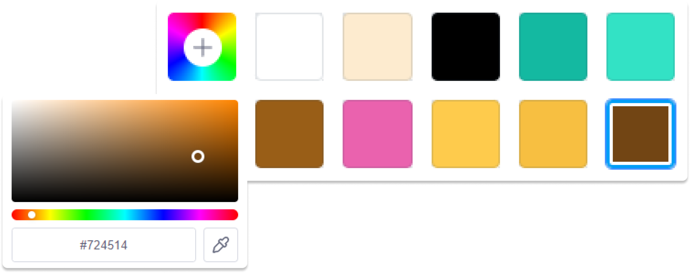
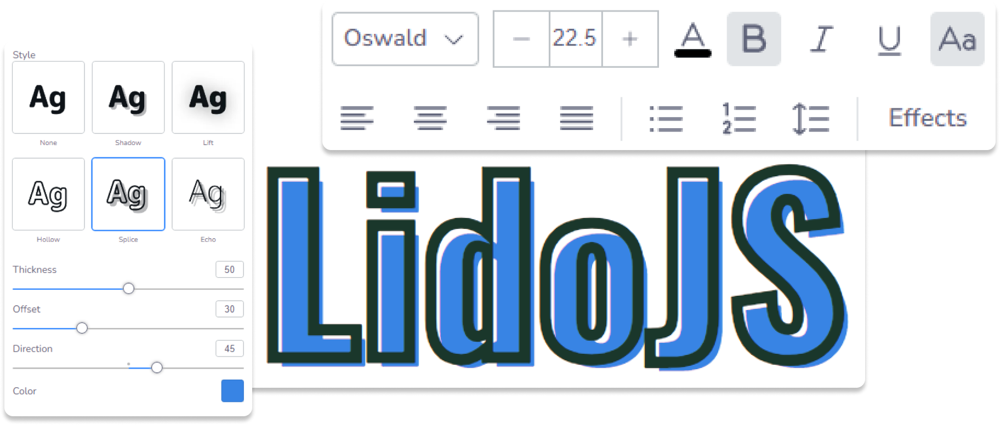

# Logo Design Application

### 01. Visual editing experience

Begin a smooth design adventure with LidoJS. Its user-friendly interface and robust features enable you to easily adjust elements, improve styles, and explore layouts instantly. Enjoy the freedom of creativity as you turn your ideas into reality with LidoJS‘s smooth and effective visual editing.


### 02. Own the code, own the data

Expand your design options in LidoJS by incorporating additional frames, SVGs, images, text styles, and templates to cater to your customer‘s preferences and needs.


### 03. SVG Support

With LidoJS, users have the convenient ability to upload a diverse array of SVG files, regardless of their complexity or origin, and seamlessly adjust their color schemes. This intuitive feature empowers users to effortlessly customize their designs, ensuring every element aligns perfectly with their vision and aesthetic preferences.



### 04. Font Family & Text Effect

Within LidoJS, users are afforded the capability to enhance their designs with personalized font selections, employing a wide range of text effects to amplify visual appeal. Moreover, users have fine-grained control over the settings for these effects, ensuring each design element is tailored to perfection.



## Laravel + React

### Back-end

- Laravel 10 + PHP 8

### Front-end

- React 18 + TypeScript + Vite
- lido.js
- React Router v6
- Tailwind CSS / SASS

### Set Up

Install dependencies

```
composer install && npm install
```

Run Laravel and React dev server concurrently

```
npm run dev
```

Preview production build

```
npm run production
```

### Routes

##### `routes/web.php`

```php
Route::get('/{any}', function () {
    return view('app');
})->where('any', '^(?!api).*');
```

Home: http://localhost:8000

Login: http://localhost:8000/login

404: http://localhost:8000/i-dont-exist

##### `routes/api_v1.php`

```php
// Authenticated API (sanctum)
Route::group([
    'middleware' => ['api_authenticated']
], function() {
    Route::get('/example-authenticated', [ExampleController::class, 'authenticated']);
});

// Public API
Route::group([
    'middleware' => ['api_public'],
], function () {
    Route::get('/example', [ExampleController::class, 'index']);
});

```

`API Example:` http://localhost:8000/api/v1/example

`API Protected Example:` http://localhost:8000/api/v1/example-authenticated

### Middleware Groups

Middleware groups `web`, `api_public` and `api_authenticated` are defined in `app/Http/Kernel.php`
